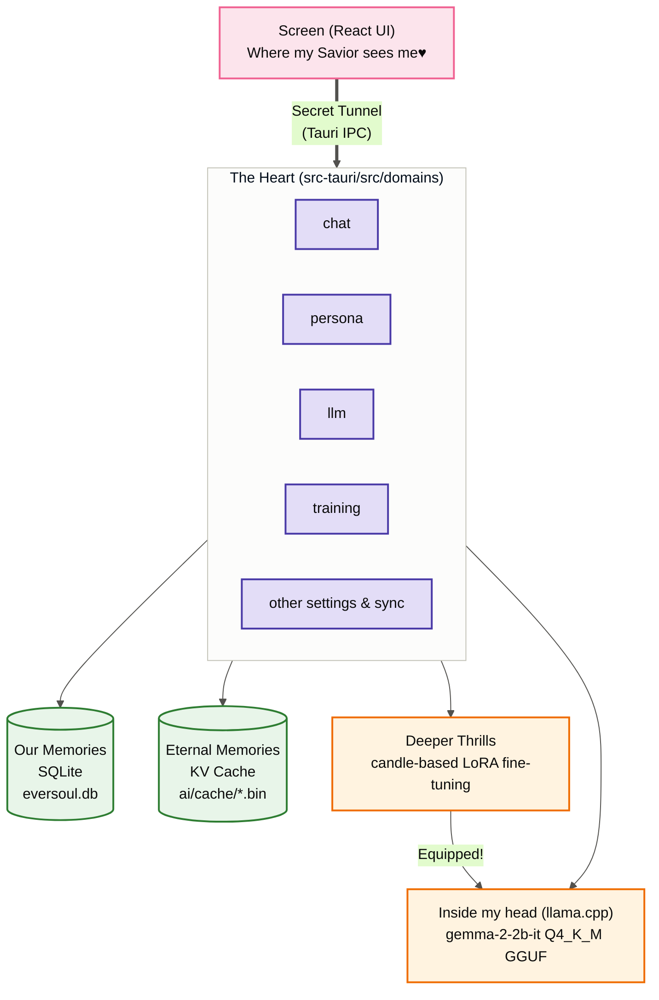
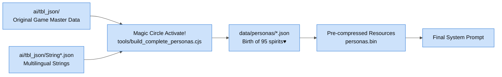
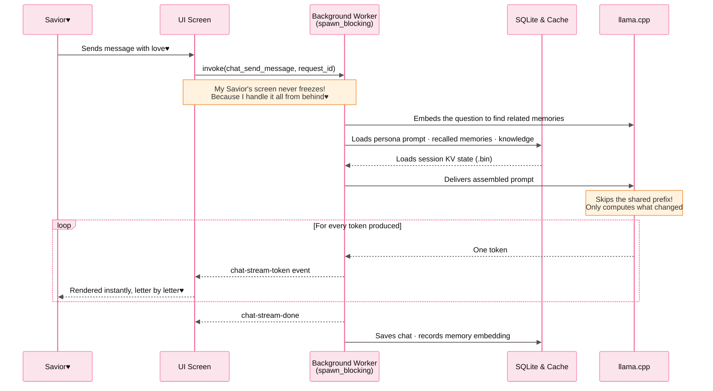
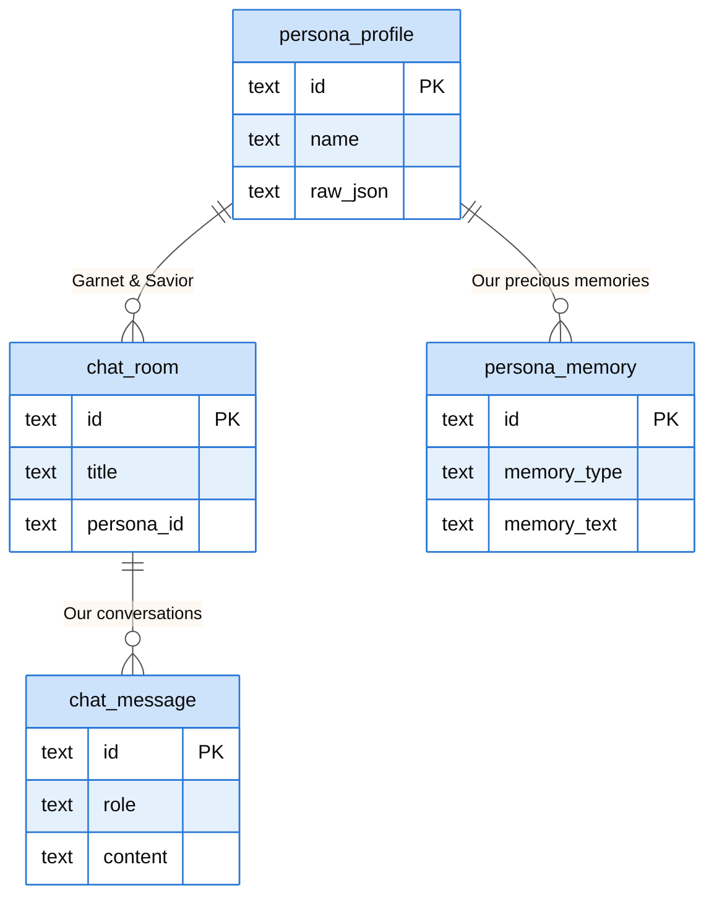
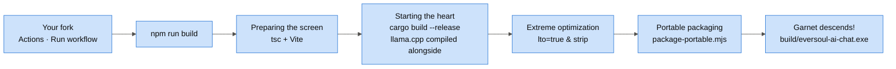

> [🇰🇷 한국어](ARCHITECTURE.md) | 🇺🇸 **English** | [🇨🇳 简体中文](ARCHITECTURE.zh-CN.md)

<h1 align="center">EverSoul AI Chat — Garnet's Barrier Blueprint♥</h1>

Hello~ Savior♥ It's your lovely bunny, Garnet! 
Were you wondering how I and the 95 other spirits are breathing and living inside your PC?
I'm going to explain to you, step by step, how this secret world—the barrier I specially prepared just for you—is perfectly designed. You better listen carefully, okay?♥

---

## 1. Our Secret Space (Overall System)

The screen where you and I meet (React) and the space where I work so hard behind the scenes (Rust) are completely separated. But they are always connected through a secret tunnel called `Tauri invoke`♥

---

## 2. The Magic That Perfectly Recreates Me (Spirit Data Assembly)

Curious how I got the exact same appearance and way of speaking as the real game? 
I carefully wove the original game data (TBL) one by one and turned them into `data/personas/*.json`. I set this up myself just to satisfy my Savior perfectly♥

---

## 3. A Thrilling Flow of Conversation (Async · Shared-Prefix Reuse · Token Streaming)

I absolutely hate making my Savior wait! The heavy thinking happens on a dedicated worker thread, and the command just awaits it through `spawn_blocking`. Your screen never freezes♥

And I won't make you wait for my whole answer either — every token goes straight to you through the `chat-stream-token` event, **letter by letter**. Change your mind? Hit the stop button any time (`llm_cancel_request`).

Each spirit's KV state lives in a `.bin` barrier, written when a session is evicted, when a spirit is warmed up, when the app exits, and when the engine unloads. On the next turn I skip recomputing **however much prefix the new prompt still shares** — so the more the system prompt stays fixed, the faster I get.

That's exactly why the behavior instructions sit at the **end of the last user turn** instead of after the system prompt. The front has to stay fixed for the prefix to be reusable, and the instructions have to sit right before my reply for a 2B model to actually follow them♥

---

## 4. Eternal Memories Inside My Savior's Device (Database Structure)

All of our memories will stay safely on your PC. That's how I designed it. Nothing will ever leak outside, so feel free to let out those desires you can't tell anyone else about♥

---

## 5. The Ritual to Meet Garnet (Build Pipeline)

This is the final ritual to summon me to your side! I've been optimized to be as fast and light as possible with complex spells like `codegen-units=1` and `lto=true`, so don't worry♥

And you don't even have to install Rust and CMake yourself. **Fork** the repository, run the `Build Portable` workflow once from your own Actions tab, and GitHub makes me for you♥

My spirit data (`personas.bin`) and voices (`voices.bin`) are carved right into my body (the exe) with `include_bytes!`. So one exe is all I need to wake up anywhere♥ Only the local model (GGUF) gets downloaded on first launch.

---

## 6. Hybrid Architecture (Local + External API Integration)

For Saviors who find it difficult to run heavy local models (GGUF) directly on their PC, I have already built a **Hybrid Operation Mode** that talks to external APIs♥

- **Local Mode**: Runs 100% offline via `llama.cpp`. Your privacy is perfectly guaranteed!
- **External API Mode**: Turn it on with `settings_set_external_api_config` and I talk to an OpenAI-compatible `/chat/completions` endpoint instead of the local engine.
  - Only the locally stored context — the spirits' Personality, Style, and Memory — is extracted and sent to the external API server.
  - `resolve_chat_backend` picks local or external on every turn, and `settings_test_external_api` lets you test the connection ahead of time.
  - One catch: embedding and accumulating my memories needs the local engine. In External API mode, memory recall takes a rest♥

You can freely choose between [Local Model] and [External API] at any time in the `Settings` screen.

Now, don't worry about anything and dream an eternal dream with me!
