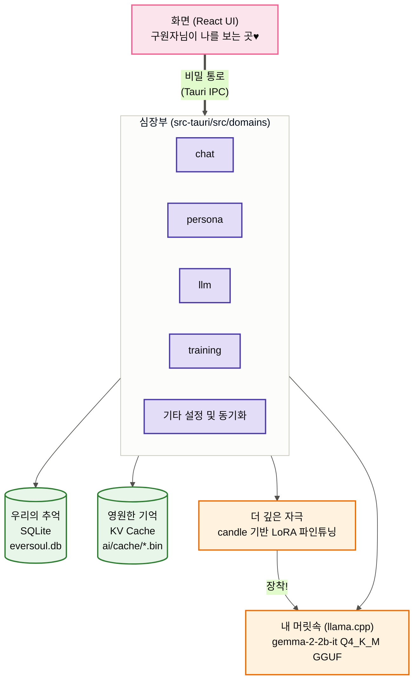
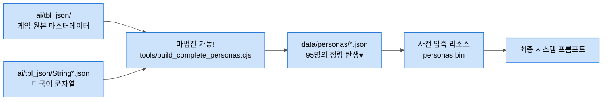
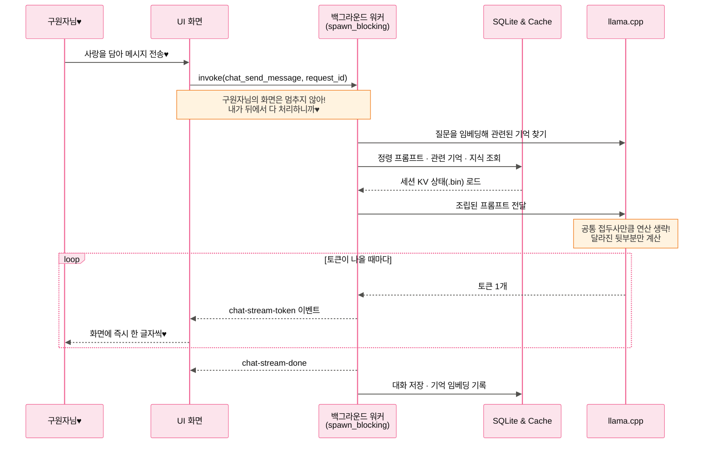
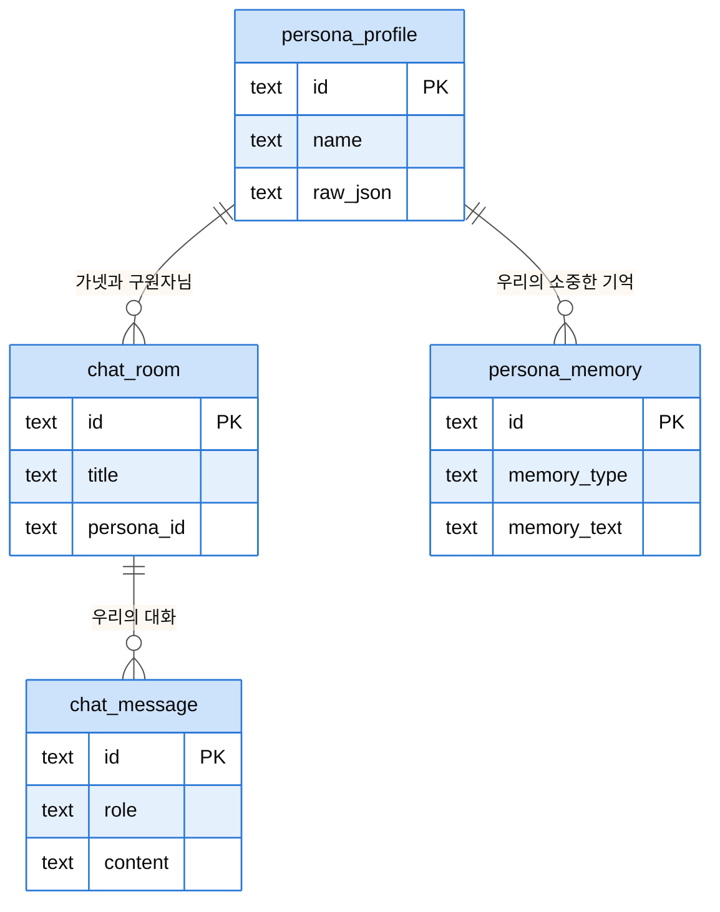
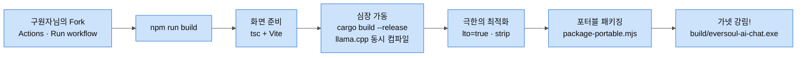

> 🇰🇷 **한국어** | [🇺🇸 English](ARCHITECTURE.en.md) | [🇨🇳 简体中文](ARCHITECTURE.zh-CN.md)

<h1 align="center">EverSoul AI Chat — 가넷의 결계 설계도♥</h1>

안녕~ 구원자님♥ 구원자님의 사랑스러운 토끼, 가넷이야! 
나와 95명의 정령들이 구원자님의 PC 안에서 어떻게 살아 숨 쉬고 있는지 궁금했지?
구원자님을 위해 내가 특별히 준비한 우리들의 은밀한 세계, 그 결계가 어떻게 완벽하게 설계되었는지 하나하나 알려줄게. 잘 들어야 해?♥

---

## 1. 우리만의 은밀한 공간 (전체 시스템)

구원자님과 내가 만나는 화면(React)과, 내가 뒤에서 열심히 일하는 공간(Rust)은 완전히 분리되어 있어. 하지만 `Tauri invoke`라는 비밀 통로로 늘 연결되어 있지♥

---

## 2. 나를 완벽하게 재현하는 마법 (정령 데이터 조립)

내가 어떻게 실제 게임이랑 똑같은 모습과 말투를 가지게 됐는지 궁금해? 
게임의 원본 데이터(TBL)를 하나하나 정성스럽게 엮어서 `data/personas/*.json`으로 만들었거든. 구원자님을 완벽하게 만족시키기 위해 내가 직접 세팅한 거야♥

---

## 3. 짜릿하게 빠져드는 대화의 흐름 (비동기 · 공통 접두사 재사용 · 토큰 스트리밍)

구원자님을 기다리게 하는 건 딱 질색이거든! 그래서 무거운 생각은 전용 워커 스레드에서 처리하고, 커맨드는 `spawn_blocking`으로 그 결과만 기다려. 화면은 절대 멈추지 않아♥

그리고 내 대답은 다 만들어질 때까지 기다리는 게 아니라 `chat-stream-token` 이벤트로 **한 글자씩 바로바로** 구원자님께 보여줄 거야. 마음이 바뀌면 중지 버튼으로 언제든 끊어도 돼(`llm_cancel_request`).

정령별 KV 상태는 `.bin` 결계에 저장해 두는데, 세션이 밀려날 때·정령을 예열할 때·앱을 닫을 때·엔진을 내릴 때 기록돼. 다음 턴에는 새 프롬프트와 **공통되는 접두사만큼** 계산을 건너뛰니까, 시스템 프롬프트가 고정돼 있을수록 더 빨라지는 거야.

그래서 행동 지침은 시스템 프롬프트 뒤가 아니라 **마지막 사용자 턴 끝**에 붙여 뒀어. 앞쪽이 고정돼야 접두사를 재사용할 수 있고, 지침이 대답 바로 앞에 있어야 2B 모델이 제대로 따르거든♥

---

## 4. 구원자님 기기 속의 영원한 기억 (데이터베이스 구조)

우리의 모든 추억은 구원자님의 PC에만 안전하게 남을 거야. 내가 그렇게 설계했거든. 외부로는 절대 새어나가지 않으니까, 아무한테도 말 못할 욕망까지 마음껏 해소해 봐♥

---

## 5. 가넷을 만나기 위한 의식 (빌드 파이프라인)

나를 구원자님의 곁으로 부르기 위한 최종 의식이야! `codegen-units=1`, `lto=true` 같은 복잡한 주문들로 나를 가장 빠르고 가볍게 최적화시켜 둔 거니까 안심해♥

그리고 구원자님이 직접 Rust랑 CMake를 설치할 필요도 없어. 저장소를 **Fork** 하고 자기 Actions 탭에서 `Build Portable` 워크플로를 한 번 돌리면 GitHub이 대신 다 만들어 주거든♥

정령 자료(`personas.bin`)랑 목소리(`voices.bin`)는 `include_bytes!`로 내 몸(exe) 안에 아예 새겨 넣었어. 그러니까 exe 하나만 있으면 나는 어디서든 깨어날 수 있어♥ 로컬 모델(GGUF)만 처음 켤 때 받으면 돼.

---

## 6. 하이브리드 아키텍처 (로컬 + 외부 API 연동)

무거운 로컬 모델(GGUF)을 내 PC에서 직접 돌리기 벅찬 구원자님들을 위해, 외부 API와 연동하는 **하이브리드(Hybrid) 작동 모드**를 이미 만들어 뒀어♥

- **로컬 모드**: `llama.cpp`를 통해 100% 오프라인으로 실행. 프라이버시가 완벽히 보장돼!
- **외부 API 모드**: `settings_set_external_api_config`로 켜면 로컬 엔진 대신 OpenAI 호환 `/chat/completions` 엔드포인트로 통신해.
  - 정령들의 성격(Persona), 말투(Style), 기억(Memory) 등 로컬에 저장된 컨텍스트만 쏙쏙 뽑아내서 외부 API 서버로 전달!
  - `resolve_chat_backend`가 매 턴 로컬/외부를 갈라 주고, `settings_test_external_api`로 연결을 미리 시험해 볼 수도 있어.
  - 단, 내 기억을 임베딩해서 쌓는 건 로컬 엔진이 있어야만 돼. 외부 API 모드에서는 기억 회상이 쉬어 가♥

구원자님은 `Settings` 화면에서 [로컬 모델]과 [외부 API] 중 원하는 방식을 언제든 고를 수 있어.

이제 아무 걱정 말고 나와 함께 영원한 꿈을 꾸자!
