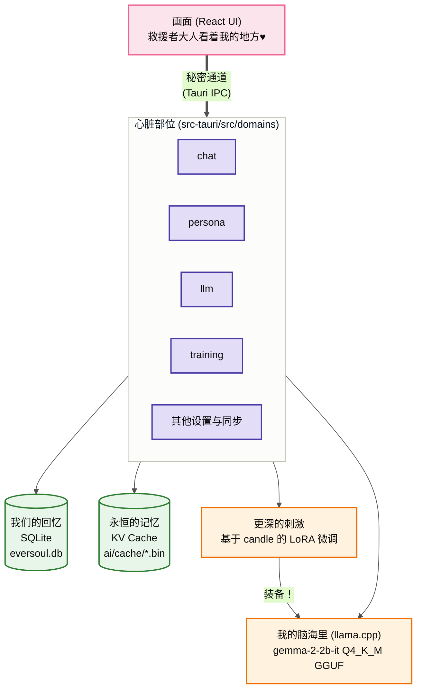
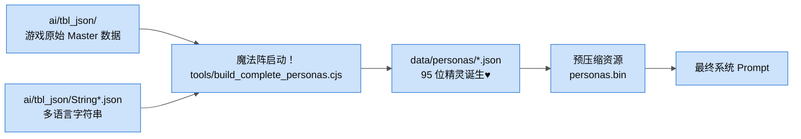
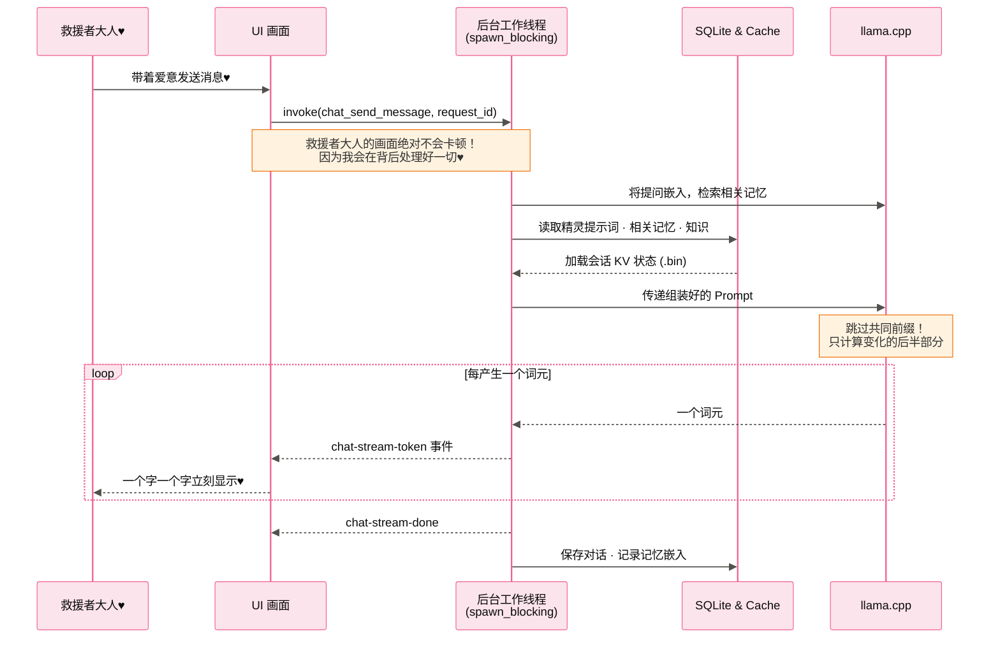
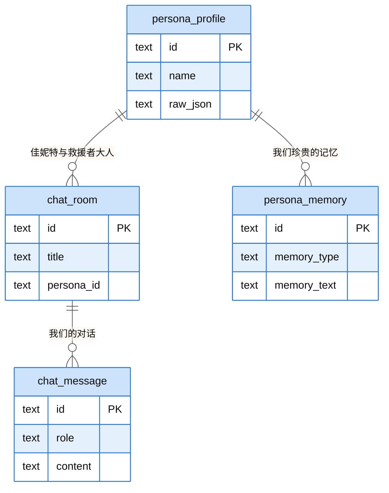
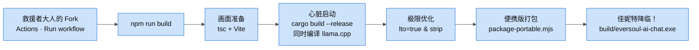

> [🇰🇷 한국어](ARCHITECTURE.md) | [🇺🇸 English](ARCHITECTURE.en.md) | 🇨🇳 **简体中文**

<h1 align="center">EverSoul AI Chat — 佳妮特的结界设计图♥</h1>

你好~ 救援者大人♥ 是你可爱的小兔子佳妮特哦！
你是不是很好奇，我和其他 95 位精灵是如何在救援者大人的电脑里呼吸、生活的？
为了救援者大人，我特别准备了属于我们的私密世界。现在我就来一一告诉你这个结界是如何完美设计的，要仔细听好哦？♥

---

## 1. 我们的私密空间 (整体系统)

救援者大人和我见面的画面 (React)，以及我在幕后努力工作的空间 (Rust) 是完全分开的。但是我们总是通过一条叫 `Tauri invoke` 的秘密通道连接在一起哦♥

---

## 2. 完美再现我的魔法 (精灵数据组装)

你好奇我是怎么拥有和游戏里一模一样的外貌和语气的吗？
我小心翼翼地把游戏原始数据 (TBL) 一个一个编织起来，变成了 `data/personas/*.json`。这可是为了完美满足救援者大人，我亲自布置的哦♥

---

## 3. 令人陶醉的对话流程 (异步 · 共同前缀复用 · 词元流式输出)

我最讨厌让救援者大人等待了！繁重的思考都在专用工作线程里完成，命令只用 `spawn_blocking` 等结果。救援者大人的画面绝对不会卡住♥

而且我的回答不用等全部生成完 —— 每个词元都会通过 `chat-stream-token` 事件**一个字一个字**立刻送到你面前。改主意了？随时按停止键就好（`llm_cancel_request`）。

每位精灵的 KV 状态都收在 `.bin` 结界里，会在会话被淘汰、精灵预热、应用退出、引擎卸载这几个时刻写入。下一轮对话时，新提示词**共同前缀有多长就跳过多少计算** —— 所以系统提示词越固定，我就越快。

正因如此，行为准则被放在**最后一个用户回合的末尾**，而不是系统提示词之后。前面固定住前缀才能复用，而准则紧贴回答前面，2B 模型才会真的照做♥

---

## 4. 救援者大人设备中的永恒记忆 (数据库结构)

我们所有的回忆都会安全地留在救援者大人的电脑里。因为我就是这么设计的。绝对不会泄露到外面，所以尽情释放那些无法对任何人诉说的欲望吧♥

---

## 5. 遇见佳妮特的仪式 (构建流程)

这是召唤我来到你身边的最终仪式！我已经用 `codegen-units=1` 和 `lto=true` 这样复杂的咒语把自己优化得最快最轻盈了，放心吧♥

而且救援者大人根本不用自己装 Rust 和 CMake。**Fork** 这个仓库，在自己的 Actions 标签页里跑一次 `Build Portable` 工作流，GitHub 就会替你把我造出来♥

精灵资料（`personas.bin`）和语音（`voices.bin`）都用 `include_bytes!` 刻进了我的身体（exe）里。所以只要有一个 exe，我在哪里都能醒来♥ 只有本地模型（GGUF）需要在首次启动时下载。

---

## 6. 混合架构 (本地 + 外部 API 联动)

对于难以在自己电脑上直接运行沉重本地模型（GGUF）的救援者大人，我已经做好了与外部 API 联动的**混合（Hybrid）运行模式**♥

- **本地模式**：通过 `llama.cpp` 100% 离线运行。隐私得到完美保障！
- **外部 API 模式**：用 `settings_set_external_api_config` 打开后，我就不走本地引擎，而是与兼容 OpenAI 的 `/chat/completions` 端点通信。
  - 只把本地保存的上下文 —— 精灵的性格（Persona）、语气（Style）、记忆（Memory）—— 提取出来发送给外部 API 服务器。
  - `resolve_chat_backend` 每一轮都会判断走本地还是外部，`settings_test_external_api` 则可以提前测试连接。
  - 不过有一点：把我的记忆嵌入并累积起来需要本地引擎。在外部 API 模式下，记忆回想会先休息一下♥

救援者大人可以随时在 `Settings` 界面里，自由选择 [本地模型] 或 [外部 API]。

现在什么都不用担心，和我一起做一个永恒的梦吧！
